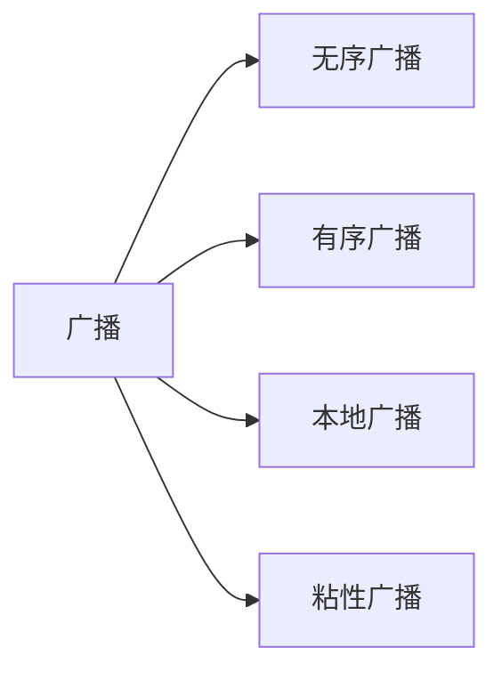

[TOC]

#### BroadcastReceiver知识总结

---

##### 一.定义

BroadcastReceiver是Android四大组件之一，是一种消息型组件，用于在不同的组件乃至不同的应用之间传递消息。其内部通信通过`binder`机制实现

##### 二. 广播种类



- 无序广播

  也称为标准广播，是一种异步执行的广播，在广播发出之后，所有的广播接收器都能接收到该广播，没有先后顺序且接收者无法修改发送的数据

  ```java
  context.sendBroadcast(intent);
  ```

- 有序广播

  是一种同步执行的广播，同一时刻只有一个广播接收器能收到这条广播，高优先级的接收者可以修改其中要发送的内容，其处理完毕后才会继续传递给下一个接收者

  ```java
  //发送广播
  context.sendOrderedBroadcast(intent);
  //拦截广播
  abortBroadcast();
  //传递数据给下一个接收者
  setResultData
  ```

  通过设置`android:property`属性来设置优先级，未设置时默认按照注册的顺序接收广播

  优先级对无序广播也生效，动态注册的广播优先级按先后顺序。

- 本地广播(已被废弃，可以自行依赖或使用LiveData代替)

  只在App内传递的广播，发送和注册都要使用`LocalBroadcastManager`类实现

  ```java
  //发送广播
  LocalBroadcastManager.getInstance(context).sendBroadcast(intent);
  //注册广播
  LocalBroadcastManager.getInstance(context).registerReceiver(receiver, intentFiter);
  ```

  内部通过`Handler`进行实现，与其它广播相比它无需跨进程，内部保存了两个Map集合，*mReceivers*和*mActions*进行协作。

  本地广播无法通过静态注册方式来接收。

- 粘性广播

  在广播发送结束后会保存刚刚发送的广播(Intent),接收者在注册完之后可以继续使用刚才的广播。

  ```java
  //发送广播
  context.sendStickyBroadcast(intent);
  //移除广播
  context.removeStickyBroadcast(intent);
  ```

  如果在接收者注册完成前发送了多条相同`action`的粘性广播，注册完成后只会收到最后一条该`action`的广播

  发送粘性广播时需要添加

  `android:name="android.permission.BROADCAST_STICKY"`

##### 三. 注册方式

- 静态注册

  1. 创建广播接收器类

     ```java
     public class MyReceiver extends BroadcastReceiver{
         @Override
         public void onReceive(Context context, Intent intent) {
             ....
         }
     }
     ```

  2. 在AndroidManifest中注册

     ```xml
     <receiver android:name="{创建接收器类路径}"
               android:exported="true">
         <intent-filter>
             <action android:name="{接收器类响应的action}"
         </intent-filter>
     </receiver>
     ```

     `android:exported`表示是否接收其他App发送的广播，当为false时只能接收同一应用的组件或具有相同userId的应用发送的消息。有`intent-filter`默认为true，没有默认为false

     `android:permission`设置该属性后只有具有相应权限的广播发送方发送的广播才能被此接收者接收，没有设置默认赋予整个应用申请的权限

- 动态注册

  1. 创建广播接收器类,一般创建在内部

  2. 调用方法进行注册与注销

     ```java
     class MyReceiver extends BroadcastReceiver{
         @Override
         public void onReceive(Context context, Intent intent) {
             ....
         }
     }
     //注册
     context.registerReceiver(receiver, intentFilter);
     //注销
     context.unregisterReceiver(receiver);
     ```

     动态广播可以自由控制注册与注销，但必须要在程序启动后才能接收到广播

##### 四. 实现机制

基于消息发布/订阅事件模型进行实现，使用了观察者模式。其中消息订阅者是广播接收者，消息发布者是发布方，消息中心是ActivityManagerService,具体流程如下

1. 广播接收者通过`binder`机制在`AMS`中进行注册
2. 发送方通过`binder`向`AMS`发送广播
3. `AMS`根据发送方要求(IntentFilter,Permission)在已注册列表中查找广播接收者
4. `AMS`将广播发送到查找到的接收者相应的消息队列中
5. 接收者通过消息循环获取到该广播，并回调`onReceive`方法

##### 五. 启动流程

见[Android开发艺术探索第九章#Activity](../Android开发艺术探索/Android开发艺术探索第九章笔记.md#BroadcastReceiver的工作过程)

##### 六. 常用系统广播

| action                        | mean                     |
| ----------------------------- | ------------------------ |
| Intent.ACTION_PACKAGE_ADDED   | 成功安装Apk              |
| Intent.ACTION_PACKAGE_REMOVED | 成功删除Apk              |
| Intent.ACTION_REBOOT          | 重启设备                 |
| Intent.ACTION_BOOT_COMPETED   | 系统启动完成(仅广播一次) |
| Intent.ACTION_BATIERY_LOW     | 电量过低                 |

##### 七. 补充

- BroadcastReceiver不能执行耗时操作，BroadcastReceiver一般处于主线程，会导致`ANR`.
- 广播中启动`Activity`需要添加`FLAG_ACTIVITY_NEW_TASK`标记
- 广播中弹出`Alertdialog`需要设置对话框类型为`TYPE_SYSTEM_ALERT`