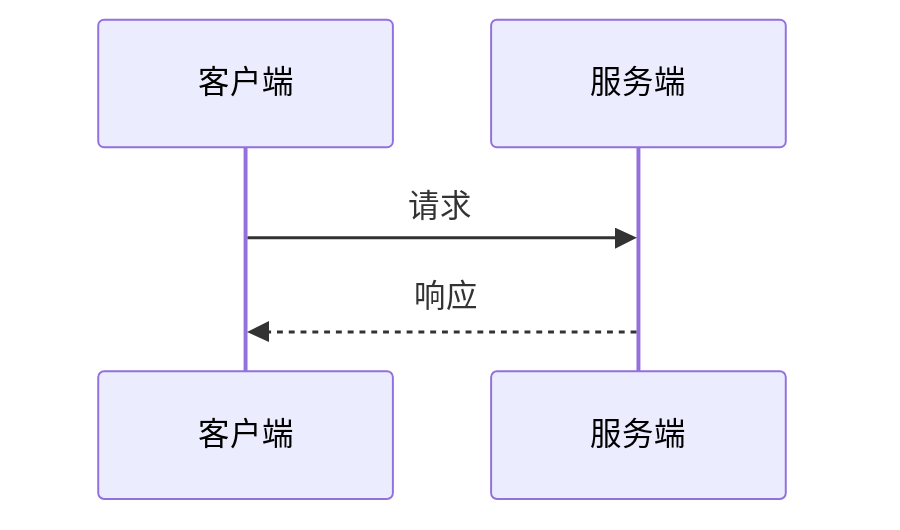

#### HTTP学习记录

---

##### 一. 定义

**HTTP**(HyperText Transfer Protocol,**超文本传输协议**)是一种用于分布式，协作式和超媒体信息系统的==应用层协议==

HTTP是一个客户端（用户）和服务端（网站）之间请求和应答的标准，通常使用TCP协议。通过使用网页浏览器、网络爬虫或者其它的工具，客户端发起一个HTTP请求到服务器上指定端口（默认端口为80）


##### 二. 工作方式

​	客户端按需求组装HTTP报文，发送给服务器，服务器处理后得到响应报文，发回给客户端，客户端处理响应报文




- URL

  格式说明： scheme://host[:port]/path/…/\[?query-string][#anchor]

  1. scheme：协议（例如：http, https, ftp）
  2. host：服务器的 IP 地址或者域名
  3. port：服务器的端口（如果是走协议默认端口，缺省端口80）
  4. path：访问资源的路径
  5. query-string：参数，发送给 http 服务器的数据
  6. anchor：锚（跳转到网页的指定锚点位置）

- HTTP报文

  - Request

    ```http
    请求行  =>  GET /test HTTP/1.1
    Headers => Host: dome.test.com
    		   Content-Type: text/plain
    		   Content-Length: 243
    Body    => xxxxxxxxxxxxxxxxxxxxx
    ```

  - Response

    ```Http
    状态行  => HTTP/1.1 200 OK
    Headers => Content-Type: text/html;charset=utf-8
    		   cache-control: public, s-maxage=31536000, max-age=31536000, immutable
    		   vary: Accept-Encoding
    		   content-encoding: gzip
    Body    => xxxxxxxxxxxxxxxxxxxx
    ```

  - Request Method

    - GET ：获取资源，没有Body
    - POST :  增加或修改资源，有Body，不幂等
    - PUT :  修改资源，有Body
    - DELETE ：删除资源，没有Body
    - HEAD ：与GET类似，但是服务器不会返回Body

  - Response Status Code

    对结果做出类型化描述，方便进行问题查找和调试

    - 1xx：临时性消息
    - 2xx：成功
    - 3xx：重定向
    - 4xx：客户端错误
    - 5xx：服务器错误

  - Header

    HTTP消息的元数据(metadata)

    > 元数据：数据的数据或属性

    - Host：服务器主机地址

    - Content-Type/Content-Length：Body的类型/长度

      Content-Type:

      - text/html：html文本，用于浏览器页面响应

      - application/x-www-form-urlencoded：普通表单，提交的表格

      - multipart/form-data：多部分形式，用于传输包含二进制内容的多项内容

        > boundary:分隔符

      - application/json：json形式，用于Web Api的响应或请求

      - image/jpeg  application/zip：单文件，用于Web Api的响应或请求

    - Chunked Transfer Encoding：分块传输编码

      ```http
      Transfer-Encoding: chunked
      ```

      Body长度无法确定，分次传递多个数据块，直到遇到`0\n`

      ⽤于当响应发起时，内容⻓度还没能确定的情况下。和 Content-Length 不同时使⽤。⽤途是尽早给
    出响应，减少⽤户等待。
  
  - Location：重定向的目标URL
  
  - User-Agent：用户代理
  
  - Range/Accept-Range：指定Body的内容范围，用于断点续传或多线程下载
  
  - Cookie/Set-Cookie：发送/设置Cookie
  
  - Authorization：授权信息
  
  - Accept：客户端能接受的数据类型
  
  - Accept-Charset：客户端接受的字符集
  
  - Accept-Encoding：客户端接受的压缩编码类型
  
  - Content-Encoding：压缩类型
  
- Cache
  
  - Cache和Buffer的区别
  
    Cache是缓存，已经使用过，后面还会用的
  
    Buffer是缓冲，未使用过的
  
  - Cache-Control
  
    no-cache：可以缓存，但是使用前需要询问服务器
  
    no-store：不要缓存
  
    max-age：有失效时间，在时间内不需要询问服务器
  
  - Last-Modified：最近改动时间
  
    - Etag
  
    - Cache-Control：中间结点是否需要缓存

##### 二. REST

**REST**(REpresentational State Transfer),表现层状态转移,一种设计风格

- 用URL定位资源
- 用Http动词(Http Method:GET,POST,DELETE)描述操作
- 用Http状态码返回结果


​    

  

  

  

  


