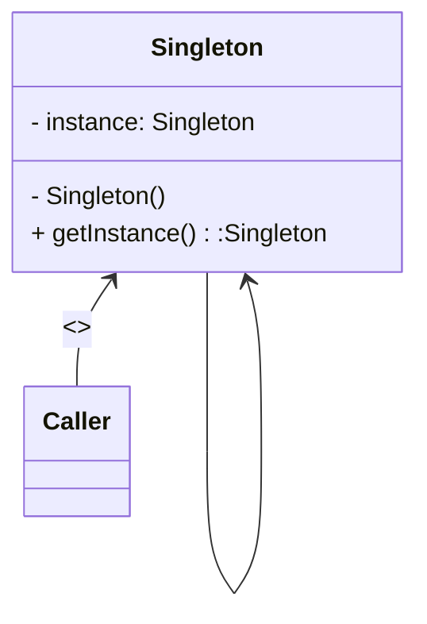

# 单例模式

### 概述

单例模式是一种创建型设计模式,它能够保证一个类只有一个实例，并提供一个访问该实例的全局节点

> 单例模式同时解决了两个问题(保证只有一个实例以及提供一个全局访问节点)，违反了单一职责原则

### 结构



### 适用场景

1. 程序中某个类对于所有的调用方都只有一个可用实例
2. 需要严格控制全局变量

### Java中的实现方式

1. ##### 饿汉式

   在第一次引用该类的时候创建对象实例

   ```java
   class Singleton{
       //创建实例时就新建对象
       private static Singleton INSTANCE = new Singleton();
       //私有构造方法，外部不能实例化对象
       private Singleton() {
       }
       //公有的静态方法，返回实例对象
       public static Singleton getInstance() {
           return INSTANCE;
       }
   }
   ```
   
   优点：在类加载时就完成了对象实例化，执行效率高，适合调用频繁的类
   
   缺点：没有懒加载的效果
   
2. #### 懒汉式

   在饿汉式的基础上增加对象判空，使得在调用时才进行实例化对象

   ```java
   class Singleton{
       //创建变量，但没有实例化
       private static Singleton INSTANCE = null;
       //私有构造方法，避免外部实例化
       private Singleton() {
   
       }
       //公有的静态方法，返回实例对象
       public static Singleton getInstance() {
           //判断是否已经实例化对象
           if (INSTANCE == null) {
               INSTANCE = new Singleton2();
           }
           return INSTANCE;
       }
   }
   ```

   优点：实现了懒加载的效果，只在调用时才进行实例化

   缺点：线程不安全，并发情况下可能会导致实例化多个对象

3. #### 加锁懒汉式

   在懒汉式的基础上加锁，保证线程安全

   ```java
   class Singleton{
       //创建变量，但不立刻实例化
       private  static Singleton INSTANCE = null;
       //私有构造方法，避免外部实例化
       private Singleton() {
       }
       //给获取方法加锁，保证线程安全
       public static synchronized Singleton getInstance() {
           if (INSTANCE == null) {
               INSTANCE = new Singleton();
           }
           return INSTANCE;
       }
   }
   ```

   优点：增加了锁，保证了线程安全

   缺点：给整个方法加了锁，并发效率降低，只需要实例化一次对象，但是每次都得加锁/释放锁,

4. #### 双重检查懒汉式

   修改加锁懒汉式的加锁方式，改为给实例化代码块加锁，双重判断是为了线程安全

   ```java
   class Singleton{
       //创建变量，但不立刻实例化
       private static Singleton INSTANCE = null;
       //私有构造方法，避免外部实例化
       private Singleton() {
       }
       public static Singleton getInstance() {
           //第一重检查，判断是否已经实例化
           if (INSTANCE == null) {
               //加锁
               synchronized (Singleton.class) {
                   //第二重判断，避免重复实例化
                   if (INSTANCE == null) {
                       INSTANCE = new Singleton4();
                   }
               }
           }
           return INSTANCE;
       }
   }
   ```

   优点：线程安全，且相比较加锁懒汉式提升了效率

   缺点：由于JVM会进行==指令重排序==，指令执行顺序会变化，导致出现空指针等异常

5. #### 双重检查懒汉式修改版

   在双重检查懒汉式基础上增加`volatile`关键字修饰，防止指令重排序

   ```java
   class Singleton{
       //创建变量，但不立刻实例化,使用volatile修饰，避免指令重排序
       private static volatile Singleton5 INSTANCE = null;
       //私有构造方法，避免外部实例化
       private Singleton() {
       }
       public static Singleton5 getInstance() {
           //第一重检查，判断是否已经实例化
           if (INSTANCE == null) {
               //加锁
               synchronized (Singleton.class) {
                   //第二重判断，避免重复实例化
                   if (INSTANCE == null) {
                       INSTANCE = new Singleton();
                   }
               }
           }
           return INSTANCE;
       }
   }
   ```

   > `volatile`是一种轻量级同步机制，可以保证指令的有序性和变量的可见性，==但是无法保证原子性==
   
6. #### 枚举类

   在Java中枚举与普通类一样，都能拥有字段和方法，且创建枚举实例是线程安全的

   ```java
   enum Singleton6 {
       INSTANCE(0xFF0000);
       private int mValue;
       Singleton6(int value) {
           this.mValue = value;
       }
   }
   ```

### Kotlin中的实现方式

1. #### 饿汉式

   在kotlin中只需要定义一个**object**对象就可实现一个饿汉单例模式.具体kotlin编译已实现

   ```kotlin
   object Singleton {
      
   }
   ```

   反编译后的Java实现如下

   ```java
   public final class Singleton1 {
      @NotNull
      public static final Singleton INSTANCE;
   
      private Singleton() {
      }
   
      static {
         Singleton var0 = new Singleton();
         INSTANCE = var0;
      }
   }
   ```

   可见使用`object`关键字创建的对象本质上是饿汉式实现，
   
2. #### 懒汉式

   ```kotlin
   //将主构造函数声明为私有，不允许直接构造
   class Singleton private constructor() {
       companion object {
           //由于kotlin没有static，在伴生对象中声明实例
           private var INSTANCE: Singleton? = null
               get() {
                   //属性声明获取逻辑，为空时创建实例
                   return field ?: Singleton()
               }
   
           @JvmStatic
           //添加同步锁
           @Synchronized
           fun getInstance(): Singleton {
               return requireNotNull(INSTANCE)
           }
       }
   }
   ```

   该实现方式与Java中的加锁懒汉式实现方式相同

3. #### 双重检查懒汉式修改版

   ```kotlin
   class Singleton private constructor() {
       companion object {
           @JvmStatic
           //使用lazy委托机制可以实现延迟加载，指定LazyThreadSafetyMode为SYNCHRONIZED可以保证线程安全
           val INSTANCE: Singleton by lazy(LazyThreadSafetyMode.SYNCHRONIZED) {
               Singleton()
           }
       }
   }
   ```

4. #### 枚举

   ```kotlin
   enum class KSingleton4(val value: Int) {
       INSTANCE(0xFF)
   }
   ```

   

