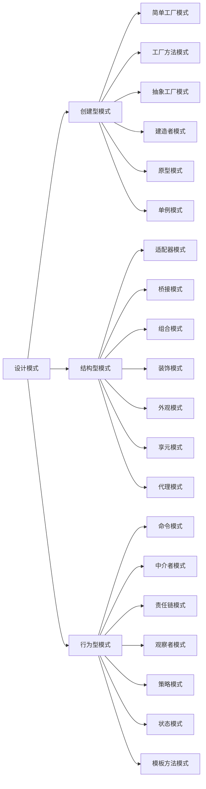

# 设计模式相关知识

------

### 定义

在软件工程中,**设计模式**是对`软件设计`中普遍存在(反复出现)的各种问题所提出的**解决方案**.

> 并非所有的软件模式都是设计模式，设计模式特指软件“设计”层次上的问题。还有其他非设计模式的模式，如[架构模式](https://zh.wikipedia.org/w/index.php?title=%E6%9E%B6%E6%A7%8B%E6%A8%A1%E5%BC%8F&action=edit&redlink=1)。同时，[算法](https://zh.wikipedia.org/wiki/%E6%BC%94%E7%AE%97%E6%B3%95)不能算是一种设计模式，因为算法主要是用来解决计算上的问题，而非设计上的问题。

### 分类

- ##### 创建型模式

  提供创建对象的机制，增加已有代码的灵活性和可复用性

  - [单例模式](创建型模式/单例模式.md)

- ##### 结构型模式

  介绍如何将对象和类组装成较大的结构，并同时保持结构的灵活和高效

- ##### 行为型模式

  负责对象间的高效沟通和职责委派
