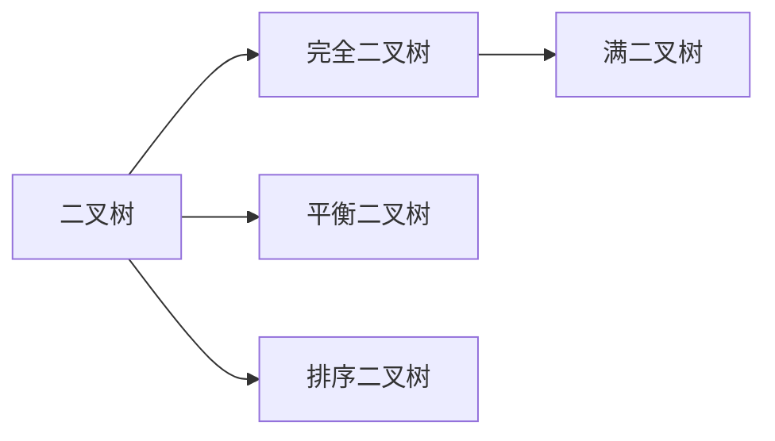

### 二叉树

---

#### 一. 定义

每个节点最多只有两个分支（即不存在分支度大于 2 的节点）的树结构。左子树和右子树是有顺序的，不能任意颠倒。

#### 二. 性质

1. 非空的二叉树，若树叶总数为`n0`,分支度为`n2`,则$n0 = n2 + 1$

#### 三. 类型



- 满二叉树(Full Binary Tree)：一棵深度为`k`，且有**2^k^ - 1**个节点的二叉树。

- 完全二叉树(Complete Tree)：除最后一层外，如其余层都是满的，并且最后一层是满的或者是在右边缺少连续若干节点的二叉树

  > 具有`n`个节点的完全二叉树的深度为$\log_2{n} + 1$
  >
  > 深度为`k`的完全二叉树，至少有**2^k-1^**个节点，至多有**2^k^ -1**个节点

- 平衡二叉树

- 排序二叉树

#### 四. 存储结构

- 顺序存储表示

  二叉树可以用数组或链接串列来存储，若是满二叉树就能紧凑排列而不浪费空间。如果某个节点的索引为*i*，（假设根节点的索引为0）则在它左子节点的索引会是$2i + 1$，以及右子节点会是$2i + 2$；而它的父节点（如果有）索引则为$ \lfloor \frac{i-1}{2} \rfloor$这种方法更有利于紧凑存储和更好的访问的局部性，特别是在前序遍历中。然而，它需要连续的存储空间，这样在存储高度为*h*的*n*个节点所组成的一般树时，将浪费很多空间。在最糟糕的情况下，如果深度为*h*的二叉树其每个节点都只有右孩子，则该存储结构需要占用**2^h^ - 1**的空间，实际上却有h个节点，浪费了不少空间，是顺序存储结构的一大缺点。

- 链表存储表示

  二叉树通常用树结点结构来存储。有时也包含指向唯一的父节点的指针。如果一个结点的子结点个数小于2，一些子结点指针可能为空值，或者为特殊的哨兵结点。 使用链表能避免顺序存储浪费空间的问题，算法和结构相对简单，但使用二叉链表，由于缺乏父链的指引，在找回父节点时需要重新扫描树得知父节点的节点地址。

  ```java
  public class TreeNode {
      public int val;
      public TreeNode left;
      public TreeNode right;
  
      public TreeNode(int x) {
          val = x;
      }
  }
  ```

#### 五. 遍历方法

- 前序遍历：先访问根节点，再访问根的左节点和右节点

  ```java
  //递归方式
  public List<Integer> preorderTraversal(TreeNode root) {
      List<Integer> list = new ArrayList<>();
      treeNodeTraversal(list, root);
      return list;
  }
  private void treeNodeTraversal(List<Integer> list, TreeNode root){
      if (root == null) {
          return;
      };
      //访问根节点
      list.add(root.val);
      //遍历左子树
      treeNodeTraversal(list, root.left, 0);
      //遍历右子树
      treeNodeTraversal(list, root.right, 0);
  }
  
  //迭代方式
  public List<Integer> preorderTraversal(TreeNode root) {
      List<Integer> list = new ArrayList<>();
      if (root == null) {
          return list;
      }
      Stack<TreeNode> stack = new Stack<>();
      //将根节点压入栈中
      stack.push(root);
      while (!stack.isEmpty()) {
          TreeNode node = stack.pop();
          //访问根节点
          list.add(node.val);
          //由于栈是先入后出，所以右子节点先入栈，左子节点后入栈
          if (node.right != null) {
              stack.push(node.right);
          }
          if (node.left != null) {
              stack.push(node.left);
          }
      }
      return list;
  }
  ```

- 中序遍历：先遍历左子节点，再遍历根节点，最后遍历右子节点

  ```java
  //递归方式
  public List<Integer> inorderTraversal(TreeNode root) {
      List<Integer> list = new ArrayList<>();
      treeNodeTraversal(list, root);
      return list;
  }
  private void treeNodeTraversal(List<Integer> list, TreeNode root){
      if (root == null) {
          return;
      };
      //先遍历左子节点
      treeNodeTraversal(list, root.left, 0);
      //访问
      list.add(root.val);
      treeNodeTraversal(list, root.right, 0);
  }
  
  //非递归方式
  //先将左节点全部入栈，遍历到叶子节点后一层层向上遍历根节点和右节点
  public List<Integer> preorderTraversal(TreeNode root) {
      List<Integer> list = new ArrayList<>();
      if (root == null) {
          return list;
      }
      Stack<TreeNode> stack = new Stack<>();
      TreeNode node = root;
      //判断条件 1. 栈为空，即遍历完毕或开始遍历；
      //		  2. node不为空则开始遍历
      while (!stack.isEmpty() || node != null) {
          if (node != null) {
              //将左节点入栈
              stack.push(node);
              node = node.left;
          } else {
              //左节点不存在，则访问该节点，再遍历右节点
              node = stack.pop();
              list.add(node.val);
              node = node.right;
          }
      }
      return list;
  }
  ```

- 后序遍历：先遍历左子节点，再遍历右子节点，最后遍历根节点

  ```java
  //递归方式
  public List<Integer> inorderTraversal(TreeNode root) {
      List<Integer> list = new ArrayList<>();
      treeNodeTraversal(list, root);
      return list;
  }
  private void treeNodeTraversal(List<Integer> list, TreeNode root){
      if (root == null) {
          return;
      };
      //遍历左子树
      treeNodeTraversal(list, root.left, 0);
      //遍历右子树
      treeNodeTraversal(list, root.right, 0);
      //访问根节点
      list.add(root.val);
  }
  
  //非递归方式
  //前序遍历结果为“根左右”，如果修改遍历次序则为“根右左”，在进行倒序则为后序遍历“左右根”
  public List<Integer> preorderTraversal(TreeNode root) {
      List<Integer> list = new ArrayList<>();
      if (root == null) {
          return list;
      }
      //遍历栈,遍历树节点
      Stack<TreeNode>  stack = new Stack<>();
      //记录“根右左”遍历的值
      Stack<Integer> temp = new Stack<>();
      stack.push(root);
      //根据前序遍历修改遍历次序，使结果输出"根右左"
      while (!stack.isEmpty()) {
          TreeNode node = stack.pop();
          temp.push(node.val);
          if (node.left != null) {
              stack.push(node.left);
          }
          if (node.right != null) {
              stack.push(node.right);
          }
      }
      //将“根右左”的结果倒序输出为"左右根"
      while (!temp.isEmpty()) {
          list.add(temp.pop());
      }
      return list;
  }
  ```

- 层次遍历：每一层按照从左到右的顺序打印节点

  ```java
  //非递归方式
  //使用一个队列，依次将节点子节点入队列，再依次出队列即可
  public List<List<Integer>> levelOrder(TreeNode root) {
      List<List<Integer>> result = new ArrayList<>();
    if (root == null) {
          return result;
      }
      //遍历队列
      Queue<TreeNode> queue = new ArrayDeque<>();
      //先将根节点入队列
      queue.add(root);
      while ( !queue.isEmpty()) {
          //每层的数据放在一个数组中
          List<Integer> temp = new ArrayList<>();
          //当前队列里元素的数量就是当前层数的总节点数量
          int size = queue.size();
          //使用一个循环遍历当前层数所有的节点
          for (int i = 0 ; i < size ; i ++) {
              TreeNode node = queue.poll();
              if (node !=null) {
                  //访问当前节点，并将其子节点入队列
                  temp.add(node.val);
                  if (node.left != null) {
                      queue.add(node.left);
                  }
                  if (node.right != null) {
                      queue.add(node.right);
                  }
              }
          }
          //一层遍历完成，将数据添加到结果中
          result.add(temp);
      }
      return result;
  }
  
  //递归方式
  //增加level表示层级，根据节点的层级，将节点的数据添加到想要数组中
  public List<List<Integer>> levelOrder(TreeNode root) {
      List<List<Integer>> result = new ArrayList<>();
      if (root == null) {
          return result;
      }
      //加入根节点，开始递归遍历
      levelOrderDfs(1, root, result);
      return result;
  }
  
  private void levelOrderDfs(int level, TreeNode node, List<List<Integer>> lists) {
      //当前层级无相应数组时，添加一个空数组
      if (lists.size() < level) {
          lists.add(new ArrayList<>());
      }
      //访问节点值，并将其添加到对应层级的数组里
      lists.get(level - 1).add(node.val);
      //层级递增，遍历下一层，递归遍历左子节点和右子节点
      if (node.left != null) {
          levelOrderDfs(level + 1, node.left, lists);
      }
      if (node.right != null) {
          levelOrderDfs(level + 1, node.right, lists);
      }
  }
  ```
  
  