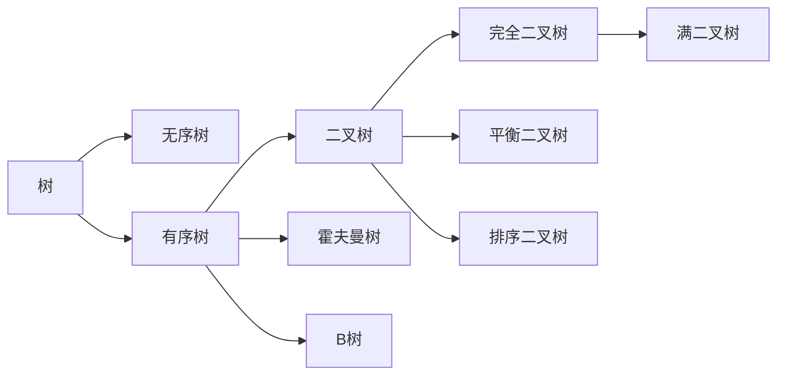
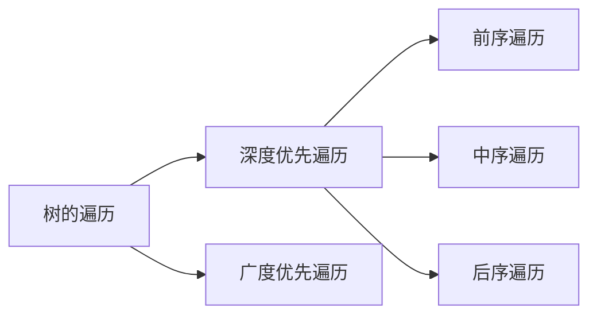

### 树

---

#### 一. 定义

树是一种 ` 抽象数据类型(ADT)` 或是实现这种抽象数据类型的数据结构，用来模拟具有树状结构性质的数据集合。它是由 n 个有限节点组成的一个具有层次关系的集合。

> 抽象数据类型(**A**bstract **D**ata **T**ype，**ADT**),是计算机科学中具有类似行为的特定类别的数据结构的数学模型

#### 二. 特点

- 每个节点只有有限个子节点或无子节点
- 没有父节点的节点称为根节点
- 每一个非根节点有且只有一个父节点
- 树里面没有环路

#### 三. 术语

1. **节点的度**：一个节点含有的子树的个数称为该节点的度
2. **树的度**：一棵树中，最大的节点度称为树的度
3. **叶节点**或**终端节点**：度为零的节点
4. **非终端节点**或**分支节点**：度不为零的节点
5. **父亲节点**或**父节点**：若一个节点含有子节点，则这个节点称为其子节点的父节点
6. **孩子节点**或**子节点**：一个节点含有的子树的根节点称为该节点的子节点
7. **兄弟节点**：具有相同父节点的节点互称为兄弟节点
8. 节点的**层次**：从根开始定义起，根为第 1 层，根的子节点为第 2 层，以此类推
9. **深度**：对于任意节点 n,n 的深度为从根到 n 的唯一路径长，根的深度为 0
10. **高度**：对于任意节点 n,n 的高度为从 n 到一片树叶的最长路径长，所有树叶的高度为 0
11. **堂兄弟节点**：父节点在同一层的节点互为堂兄弟
12. **节点的祖先**：从根到该节点所经分支上的所有节点
13. **子孙**：以某节点为根的子树中任一节点都称为该节点的子孙
14. **森林**：由 m（m>=0）棵互不相交的树的集合称为森林

#### 四. 树的分类

- 无序树：树中任意节点的子节点之间没有顺序关系
- 有序树：树中任意节点的子节点之间有顺序关系
  1. 二叉树：每个节点最多含有两个子树的树
  2. 霍夫曼树：带权路径最短的二叉树称为哈夫曼树或最优二叉树
  3. B 树：一种对读写操作进行优化的自平衡的二叉查找树，能够保持数据有序，拥有多于两个子树

#### 五. 树的遍历

- 深度优先遍历：先访问子节点，再访问父节点，最后是第二个子节点
  1. 前序遍历：先访问根，然后访问子树的遍历方式
     

     前序遍历：**F, B, A, D, C, E, G, I, H**.
  2. 中序遍历：先访问左（右）子树，然后访问根，最后访问右（左）子树的遍历方式
     

     中序遍历：**A, B, C, D, E, F, G, H, I**.
  3. 后序遍历:先访问子树，然后访问根的遍历方式

     

     后序遍历：**A, C, E, D, B, H, I, G, F**.
- 广度优先遍历
  
  层次遍历：**F, B, G, A, D, I, C, E, H**.
