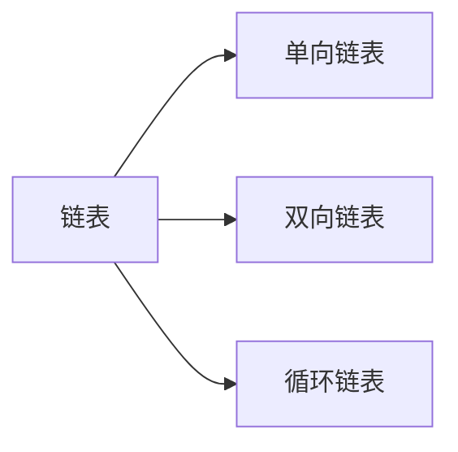

### 链表

---

#### 一. 定义

链表（Linked list）是一种常见的基础数据结构，是一种线性表，但是并不会按线性的顺序存储数据，而是在每一个节点里存到下一个节点的指针(Pointer)。

#### 二. 性质

链表通常由一连串节点组成，每个节点包含任意的实例数据和一或两个用来指向上一个/或下一个节点的位置的链接，不必须按顺序存储，链表在插入的时候可以达到**O(1)**的复杂度，但是查找一个节点或者访问特定编号的节点则需要**O(n)**的时间。

- 优点
  1. 不需要预先知道数据大小
  2. 不必须顺序存储，可以充分利用内存空间
  3. 插入删除操作简单快速
- 缺点
  1. 增加了结点的指针域，空间开销较数组大
  2. 不能随机读取。

#### 三. 类型



1. 单向链表

   

   一个单向链表的节点被分成两个部分。第一个部分保存或者显示关于节点的信息，第二个部分存储下一个节点的地址。单向链表只可向一个方向遍历。

   ```java
   public class ListNode {
       public int val;
       public ListNode next;
       public ListNode(int x) { val = x; }
   }
   ```

   - 插入

     根据插入位置分为插入头结点，插入中间节点，插入尾节点（例如需要将p结点插入单链表head中）

     1. 插入到头结点

        直接将p结点的next指向头结点即可,p为新头结点

        ```java
        p.next = head
        ```

     2. 插入中间结点m后

        遍历找到m结点，然后先将p的next指向m的next，再将m的next指向p

        ```java
        ListNode tmp = head;
        while(tmp != null) {
            if(tmp == m) {
                p.next = m.next;
                m.next = p;
                break;
            }
            tmp = tmp.next;
        }
        ```

     3. 插入到尾结点

        除了尾结点的判断条件，整体流程与插入到中间结点一致

        ```java
        ListNode tmp = head;
        while(tmp.next != null) {
            tmp = tmp.next;
        }
        tmp.next = p;
        ```

   - 删除

     与插入一致，删除也分为三种情况：删除头结点，删除中间结点，删除尾结点

     1. 删除头结点

        将头结点自身设为null即可

        ```java
        ListNode newHead = head.next;
        head = null;
        ```

     2. 删除中间结点

        只需要将目标结点的前一个结点的next指向目标结点的下一个结点，再进行自身删除即可

        ```java
        ListNode tmp = head;
        while(tmp.next != null) {
            if(tmp.next == target) {
                tmp.next = target.next;
                target = null;
                break;
            }
            tmp = tmp.next;
        }
        ```

     3. 删除尾结点

        ```java
        ListNode tmp = head;
        while(tmp.next != null) {
            tmp = tmp.next;
        }
        tmp = null;
        ```

2. 双向链表

   

   双向链表也叫双链表。双向链表中不仅有指向后一个节点的指针，还有指向前一个节点的指针。这样可以从任何一个节点访问前一个节点，当然也可以访问后一个节点，以至整个链表。

   ```java
   public class DoubleListNode {
       public int index;
       public int val;
       public DoubleListNode prev;
       public DoubleListNode next;
   }
   ```

   - 插入 : 在值索引`i`后添加结点`node`

     ```java
     //1.找到索引i的结点
     DoubleListNode tmp = head;
     while (null != tmp.next) {
         //2.在i后插入结点，先处理后续结点关系
         if (tmp.index == i) {
             node.next = tmp.next;
             tmp.next.prev = node;
             node.prev = tmp;
             tmp.next = node;
             break;
         }
         tmp = tmp.next;
     }
     ```

   - 删除 ：删除索引为`i`的结点

     ```java
     //1.找到索引i的结点
     DoubleListNode tmp = head;
     while (null != tmp) {
         if (tmp.index = i) {
             //2.将目标结点的前一个结点指向目标结点的后一个结点
             tmp.prev.next = tmp.next;
             //3.判断是否为最后一个结点，最后一个结点不需要进行处理
             if (tmp.next != null) {
                 tmp.next.prev = tmp.prev;
             }
             break;
         }
         tmp = tmp.next;
     }
     ```

3. 循环链表

   
   
   在一个 循环链表中, 首节点和末节点被连接在一起。这种方式在单向和双向链表中皆可实现。(图中以单链表为例)
   
   ```java
   public class CircleList{
       //头结点
       public ListNode head;
       //尾结点
       public ListNode tail;
       //链表长度
       private int length;
   }
   ```
   
   
   
   - 插入 ：循环链表末尾插入，新插入的结点需要指向头结点
   
     ```java
     public boolean insert(ListNode node) {
         if (head == null) {
             //空链表
             head = node;
             tail = node;
         } else {
             node.next = head;
             tail.next = node;
             tail = node;
         }
         length ++;
         return true;
     }
     ```
   
   - 删除 : 从循环链表中删除值为`i`的结点
   
     ```java
     public ListNode delete(ListNode node) {
         ListNode tmp = head;
         //所找结点为头结点
         if (node.equals(tmp)) {
             head = head.next;
             tail.next = head;
             length -- ;
         } else {
             //遍历找该结点
             while (tmp.next != null) {
                 if (node.equals(tmp.next)) {
                     ListNode n = tmp.next.next;
                     tmp.next = n;
                     length --;
                     break;
                 }
                 tmp = tmp.next;
             }
         }
         return tmp;
     }
     ```
   
     

#### 四. 常见应用

​		链表用来构建许多其它数据结构，如堆栈，队列和他们的派生。